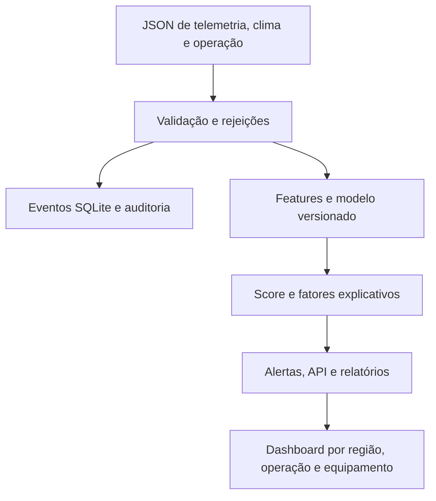

# Sompo Risk MVP — FIAP Challenge Sompo Seguros, Sprint 4

MVP acadêmico para análise preventiva de eventos operacionais de frotas. Recebe telemetria, clima e dados de operação, valida e registra entradas, gera um score, recomenda uma ação e apresenta tendências e comparativos. **Todos os eventos e rótulos incluídos são sintéticos.** O sistema demonstra integração técnica; não foi validado para decisão de segurança, precificação ou sinistro.

## Integrantes

| Nome informado | RM | Responsabilidade |
| --- | --- | --- |
| Camila | 569629 | A confirmar pelo grupo |
| João | 571052 | A confirmar pelo grupo |
| Lucas | 569580 | A confirmar pelo grupo |
| Gabriel | 569179 | A confirmar pelo grupo |

Sobrenomes, papéis e contribuições individuais não foram fornecidos. O grupo deve completar essas informações com o histórico real, sem atribuições inventadas.

## Arquitetura e fluxo



- `app/validation.py`: contrato, faixas e UTC; eventos inválidos entram em `rejections`.
- `app/ingestion.py`: idempotência por `event_id`, persistência transacional de evento, score e trilha de auditoria.
- `app/features.py` e `app/model.py`: variáveis numéricas, treino temporal 70/15/15 e inferência; ausência de temperatura tem indicador próprio.
- `app/alerts.py`: faixas 0–39 normal, 40–69 atenção, 70–100 alta; fatores e recomendações baseados em regras transparentes.
- `app/api.py`: endpoints de ingestão, decisão, histórico, comparativos e verificação de auditoria.
- `dashboard/index.html`: indicadores, tendência média diária, filtros e comparação de regiões e operações.
- `data/generate_synthetic.py`: gerador determinístico de exemplos e rótulos **fictícios**.
- `tests/`: cenários de contrato, duplicidade, acesso, adulteração de log e API.
- `docs/relatorio_final.pdf` e `docs/evidencias/`: relatório corrigido e saídas reais da execução local.

## Executar no Windows (PowerShell)

Na raiz do projeto, com Python 3.10 ou superior:

```powershell
py -m venv .venv
.venv\Scripts\Activate.ps1
python -m pip install -r requirements.txt
python data/generate_synthetic.py
python -m app.model train --input data/raw/synthetic_labeled.csv --output models/risk_model.joblib
python -m app.ingestion --input data/raw/sample_events.json
python -m pytest -q
python -m uvicorn app.api:app --reload
```

Em Linux/macOS, ative com `source .venv/bin/activate` e use `python` no lugar de `py`. Abra `http://127.0.0.1:8000/`; documentação da API em `/docs`. O painel usa `demo-manager` por padrão. Executar a ingestão de novo não duplica os eventos. Para reiniciar a demonstração, remova o arquivo local `sompo.db` e ingira novamente.

Variáveis: `SOMPO_DB` (caminho do SQLite), `SOMPO_OPERATOR_TOKEN`, `SOMPO_MANAGER_TOKEN`, `SOMPO_ANALYST_TOKEN`. A demonstração usa respectivamente `demo-operator`, `demo-manager` e `demo-analyst`. Não use esses tokens padrão em rede pública.

Exemplo de API:

```bash
curl -X POST http://127.0.0.1:8000/events -H 'Authorization: Bearer demo-operator' -H 'Content-Type: application/json' --data '{"event_id":"evt-api-1","equipment_id":"EQ-042","timestamp":"2026-09-18T12:00:00Z","region":"Sudeste","operation_type":"urbana","speed_kmh":82,"engine_temp_c":112,"rain_mm":3.4,"maintenance_days":22,"hard_brakes":7}'
```

Endpoints: `POST /events`, `GET /scores`, `GET /equipment/{id}`, `POST /events/{id}/decisions`, `GET /reports/summary`, `GET /audit/integrity`. O operador não vê o agregado da frota; gestor e analista podem consultar o agregado; só o analista verifica a cadeia de auditoria. É RBAC demonstrativo, sem vínculo real de usuários a frotas.

## Dados, modelo e resultados medidos

O gerador usa semente 42 e produz 400 linhas sintéticas; o rótulo é sorteado de uma função de risco artificial. Os registros são ordenados por timestamp: 280 treino, 60 validação, 60 teste. O limiar de classificação é escolhido **só na validação**, buscando recall mínimo de 0,80 quando possível; as métricas abaixo são medidas apenas no teste. A API exibe faixas fixas de score para comunicação, distintas do limiar usado para medir o classificador.

| Métrica no teste sintético | Resultado observado |
| --- | ---: |
| Recall | 0,7200 |
| Precisão | 0,4865 |
| F1 | 0,5806 |
| PR-AUC | 0,6675 |
| Brier | 0,2218 |

O modelo e as métricas reproduzíveis estão em `models/`. O hash SHA-256 da base consta em `models/risk_model.json`. Esses valores **não atingem as metas ilustrativas do PDF inicial** e não predizem desempenho em dados reais. Uma regra `demo-rule-v1` é usada se o arquivo de modelo não estiver disponível; ela não é calibrada. Recomendações e três fatores vêm de regras, não de atribuições do classificador.

## Evidências de validação

- [`docs/evidencias/testes.txt`](docs/evidencias/testes.txt): 7 testes automatizados passaram na execução local.
- [`docs/evidencias/execucao.json`](docs/evidencias/execucao.json): ingestão de 3 eventos, scores e versão do modelo, integridade da cadeia de auditoria.
- [`docs/evidencias/ingestao.jsonl`](docs/evidencias/ingestao.jsonl): saída direta da ingestão demonstrativa.
- [`models/risk_model.json`](models/risk_model.json): métricas calculadas e hash da base.

Os testes não comprovam proteção contra alteração total do banco, carga, tolerância a falhas externas ou qualidade preditiva real. O SQLite e os tokens estáticos são adequados apenas à demonstração local. Para produção: cadastro e vínculo de equipamentos, autenticação robusta, TLS, segredos, dados históricos autorizados, consentimento e governança, calibração, testes de deriva e monitoramento.

## Evolução das Sprints e decisões técnicas

O enunciado informa que as Sprints 1–3 deveriam ter estabelecido problema, base, modelo e integração. **Os artefatos e as decisões reais dessas etapas não foram fornecidos.** Esta entrega não atribui trabalho passado ao grupo. Registrar aqui as User Stories escolhidas, links dos commits/entregas anteriores, ajustes e responsáveis quando o grupo enviar esse material.

Na Sprint 4 deste pacote: modularização em Python; contrato de entrada; persistência idempotente SQLite; modelo linear reproduzível com divisão temporal; token por papel para demonstração; trilha hash; testes; relatório e dashboard. SQLite reduz dependências para reprodução local. A regressão logística facilita inspeção, mas os dados sintéticos não validam seu uso em campo.

## Entrega final

- GitHub: repositório **privado** criado em https://github.com/Pearcy000/sompo-risk-mvp. O convite ao perfil `fiap-tutoria` ainda precisa ser enviado e aceito; adicionar apenas os integrantes autorizados. Não alterar após o prazo da FIAP.
- Vídeo: gravar narração **humana**, demonstrar o fluxo em até 5 minutos e publicar no YouTube como **não listado**. [Roteiro pronto](docs/roteiro_video.md). **URL ainda não preenchida.**
- Capturas do painel: produzir ao executar localmente e adicionar em `docs/evidencias/`; as evidências de API e testes já foram geradas.
- Caso o grupo queira sigilo e não concorrer ao prêmio, seguir a instrução do enunciado e declarar isso na primeira capa. Essa escolha pertence ao grupo.
